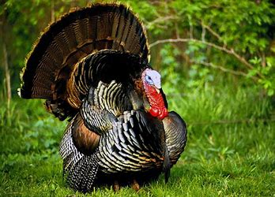

CS3780 Introduction to Computational Theory (Fall 2023)
=======================================================

---

- **How to get in touch with me:** M, W: 11:00 a.m. - 12:00 p.m., F: 10:00 a.m. - 12:00 p.m., and whenever my door, Draper & Maynard Building 422, is open- **The best way to contact me:** [Email me](mailto:zshen@plymouth.edu?subject=Subject) any time between 8 a.m. and 9 p.m.: zshen@plymouth.edu- My [home page](https://turing.plymouth.edu/~zshen/)

---

Catelog Description
-------------------

Intended to provide a solid theoretical foundation for computer science students. A series of artificial machines such as finite state automata, push-down automata and Turing machines are be defined and studied as formal models of computers. Studies their corresponding formal languages such as regular, context-free and unrestricted languages. Discusses related issues such as Church's Thesis, Halting problem and general incompatibility. Falls. Prerequisite(s): CS 3221 3 Credits

General Information
-------------------

The objective of this course is to provide a solid theoretical foundation for computer science, in answering the fundamental questions of the Computer Science discipline, such as "what is a *computer*?" and "what such a computer can do and could not do?". If a problem can be solved, how? If it cannot be, why?

After reviewing some basic mathematical concepts, we will characterize the nature of a computer by studying various formal models of computers, such as finite state automata, push-down automata, and Turing machines, together with the various formal languages as characterized by such machines, such as regular languages, regular expressions and context-free languages. We will then explore their capabilities and restrictions, particularly, in terms of their decidability and computability.

Students are strongly advised to attend every class. For those who have to miss classes, I have included an extended abstract of my teaching notes within this web based syllabus.

Lectures or other class meetings for this course may be recorded by the university using USNH media platforms. Such recordings may be available for educational use by other students enrolled in the class (including both for instruction and as a review tool), the course instructor(s), and other university officials who support course instruction. Your voice or image may be captured on the recordings, and by enrolling in this course you are consenting to such recording for these purposes.

Most of the communication regarding this class will be done through email to your plymouth address, with a subject starting with "CS3780:...", so you have to regularly check your email while taking this course.

To achieve the above learning objective, numerous  homework of various difficulty degrees will be assigned within the lecture notes. Although a student should not hand in anything unless and until s/he is reasonably sure about their correctness, the answers to all the assigned homework should be handed in, the latest, *by 9 p.m. on the first business day in the following week, once a chapter is completed*. For example, if we finish a chapter by the end of this week, the assigned homework will be handed in by 9 p.m., next Tuesday, September 5, 2023 since Labor Day falls on Monday, September 4.

**A student should definitely not wait until the last day to do the homework, but get the homeworks completed right after the relevant subject is discussed.**

To develop the ability and skills of working through a rigorous process of mathematical reasoning, and enable the instructor to make comments on your work, *all the homeworks shall be typed*, preferably with Microsoft Word for entering proper symbols.

If you have a solid reason for a delay ("excused absences", as defined in the Plymouth State University [attendence policy](AttendancePolicy.pdf)) of the aforementioned homework and/or project, please let me know before the deadline, or as soon as possible afterwards. The work(s) invovled will not be included in calculating your grade for this course.

If a student finds any part of the assignment, including homework, midterm and/or final exam, is not clear, she should ask the instructor for clarification as soon as possible. The instructor will share with the whole class such a clarification, anonymously.

One *mid-term* test and one *final exam* will be given in this course. For details, check out the Evaluation segment of this syllabus.

*Anything and everything handed in for this course must be done by the signed individual.* If enough evidence shows that someone is involved with "cheating", including using computer aided tools, such as CHATGPT, the case(s) will be immediately reported to the leader of the Computer Science and Technology discipline. For relevant definitions and procedural details regarding academic integrity related issues, please refer to the recently revised University's [*policy on Academic Integrity*](https://campus.plymouth.edu/faculty-governance/wp-content/uploads/sites/20/2017/05/PSU-Academic-Integrity-Policy.pdf).

*Anything and everything, once submitted, will be considered final*. If you send it in prematurely by an accident, please send me an email right away to cancel your submission.

The instructor will try his utmost to be fair in grading students' work as a measurement of the quality of the submitted work in terms of its degree of meeting a clearly stated expectation. On the other hand, if a student believes that s/he is not given a fair grade, s/he should follow the procedure as specified in the University [*Fairgrading Policy*](https://campus.plymouth.edu/faculty-governance/wp-content/uploads/sites/20/2017/05/PSU-Fair-Grading-Policy.pdf) to appeal the grade.

As a constructive feedback, an anonymous sample solution to all the assignments, including homeworks, programming labs, various phases of the team project, midterm test, and perhaps even the final, will be posted after the event. Such a sampler serves two purposes: 1) providing an evidence of fair grading: *the same work gets the same grade*; and 2) filling the gap betweeh what you have learned and what you should have learned. As a further, and important, step of the learning process, *students are urged to study such samplers carefully, and compare them with her own works with the goal of learning what is expected*. Please do come to talk to the instructor with any further questions.

Plymouth State University is committed to providing students with documented disabilities equal access to all university programs and facilities. If you think you have a disability requiring accommodations, you should immediately contact the [Campus Accessibility Services](https://www.plymouth.edu/services/disability-services/), located in Speare 210, to determine whether you are eligible for such accommodations. Academic accommodations will only be considered for students who have registered with the Accessibility Service. If you have a Letter of Accommodation for this course from the Campus Accessibility Services Office, please provide the instructor with that information privately so that you and the instructor can review those accommodations.

The PASS (Plymouth Academic Support Services) Office offers tutoring for most undergraduate courses at PSU. If you think you would benefit from working with a tutor, stop by their office in Speare 209, or click [here](https://www.plymouth.edu/centers/plymouth-academic-support-services/) to learn more.

Student Support Foundation (SSF) provides short-term emergency financial assistance and long-term student support. Click [here](https://campus.plymouth.edu/student-support-foundation/) for more information. Student Support Foundation also runs a food pantry, located in Belknap Hall. To learn more about SSF or access the food pantry, either via open hours or a private appointment, contact the SSF advisor, at psu-ssf@plymouth.edu.

You might want to click [here](https://colab.plymouthcreate.net/resource/basic-needs-resource/) for additional information regarding other basic needs.

---

---

Resources:
----------

* **Textbook:** (*Required*) Sipser, M., *[Introduction to the Theory of
  Computation(Third Ed.)](https://www.amazon.com/Introduction-Theory-Computation-Michael-Sipser/dp/113318779X)*, [Thompson Course Technology](http://www.course.com/), Boston, MA, 2013.* **Software:** (*Required but free*) [JFLAP: An automata simulator](https://www2.cs.duke.edu/csed/jflap/)* **Additional stuff:**
      + (*Optional and free* ) Linz, P., and Roger, S. H., [JFLAP activities for formal languages and automata](notes/CS378/JFLAPActivities.pdf), Feb., 2011+ (*Optional and free* ) Morris, J., [Combinatorics]( https://open.umn.edu/opentextbooks/textbooks/combinatorics), Indepedent, 2017.

---

---

[Topics](notes/CS378/CS3780Structure.png)
-------------------------------------------------------------------------------------

1. ### [An overview](notes/CS378/note0.pdf)

* [Computer Science curriculum](https://turing.plymouth.edu/~zshen/courseCharts/CS-Course-Chart.pdf)
* History and status quo of [face recognition](https://en.wikipedia.org/wiki/Facial_recognition_system)
* [Are you really whom you claim you are](https://www.cnn.com/2018/06/22/us/orlando-airport-face-scanning)?
* [How does MA Police use face recognition technology](https://www.npr.org/2021/05/07/982709480/massachusetts-pioneers-rules-for-police-use-of-facial-recognition-tech)?
* [What language does monkey speak?](https://en.wikipedia.org/wiki/Great_ape_language)
* [Animals are talking... What does it mean?](https://www.nytimes.com/2023/09/20/magazine/animal-communication.html?unlocked_article_code=HgPg051C47HcTqdScXZDbM_7mYgBskTk6e-ryxmggqjTe-d2fOiMZyXA6bA2Dz9LZhZRZT15WQBav3-zZlIxmbW1A7B_9Efq4dL9o5ab9uCHPAryRvN7Ks_UJTe340VbNVmjURQUpD0yWCe7DaQE07uTq8mpSkVkxZxp7WZk84piNdno0B5fXEl4eRpCgr_10s6D26vEKXw_cbPqQCSYpQE3KxteLD29nd_ucIqLIOySMLcGUsQbOoDXoZJkjJH6bVaDpdQXBIbiGFVJLnI4Ahry1tCvpvJzycgD7H1RHoq2muOAaR42V3eeAexTxPSrMQFL-_oierVVw-kOGFLc&smid=url-share)
* [Can we talk to whales?](https://www.newyorker.com/magazine/2023/09/11/can-we-talk-to-whales)
* Further reading of the [Halting](https://brilliant.org/wiki/halting-problem/) problem* Progress in solving the  [SAT](notes/CS378/SATSolverCACM062023.pdf) problem
* [ACM 2020 Turing Award on compilers](notes/CS378/compilerCACM102021.pdf)
* A general introduction to [minimum Stenier tree](https://en.wikipedia.org/wiki/Steiner_tree_problem)
* Some [applications](https://personal.utdallas.edu/~besp/teaching/mst-applications.pdf) of minimum Steiner tree
* [History of AI (I)](notes/CS378/aiHIistoryCACM062023.pdf)
* A [better way](notes/CS378/ToCACM102020.pdf) of teacing this course?
* A more fitting [model of computation](notes/CS378/modelComputation.pdf)
- ### [Mathy background](notes/CS378/note1.pdf)

Review and preview various mathematical notions
and terminology, and introduce various ways of providing mathematical proof.

* [One-way streets](http://calmstreetsboston.blogspot.com/2010/05/one-way-street-with-reversing-direction.html) in Boston
* More [3-regular](https://mathworld.wolfram.com/CubicPolyhedralGraph.html) graphs
* What about [modus ponens](https://en.wikipedia.org/wiki/Modus_ponens)?
* [There are infinite number of prime numbers.](https://en.wikipedia.org/wiki/Euclid%27s_theorem#:~:text=Euclid's%20theorem%20is%20a%20fundamental,Euclid%20in%20his%20work%20Elements.)
* [Prime factorization result](https://en.wikipedia.org/wiki/Fundamental_theorem_of_arithmetic#:~:text=In%20number%20theory%2C%20the%20fundamental,that%2C%20moreover%2C%20this%20representation%20is)
* [How to find a prime factorization of a number](https://study.com/academy/lesson/how-to-find-the-prime-factorization-of-a-number.html)?
* [Math has a fatal flaw](https://www.youtube.com/watch?v=HeQX2HjkcNo)
* What does the [pigeonhole principle](https://www.youtube.com/watch?v=4Dz4vNUxnZM) mean and where could it be used?
* More [examples](https://math.berkeley.edu/~rhzhao/10BSpring19/Worksheets/Discussion%203%20Solutions.pdf) on the pigeon-hole principle
* **Homework** for this Chapter is due by 9 p.m. on Monday, September 18, 2023.- ### [Finite automata and regular languages](notes/CS378/note2.pdf)

Define, analyze and design finite automata(FA), the class of simplest computers. Prove the equivalence between deterministic finite automata(DFA) and non-deterministic finite automata(NFA), as well as that between FA and regular expressions. Demonstrate various closure properties enjoyed by the languages accepted by FA, and the existence of strictly stronger automata via pumping lemma.

* A [richer finite state automata](notes/CS378/DFACACM052021.pdf)
* A [colorful perspective](http://grammarware.net/slides/2014/regular.pdf) of regular languages in the formal language hierarchy
* [Applications](http://cs.wellesley.edu/~cs235/fall11/lectures/22_reglang_apps.pdf) of regular languages
* More [applications](http://citeseerx.ist.psu.edu/viewdoc/download?doi=10.1.1.138.4212&rep=rep1&type=pdf) of regular laguages
* Dana Scott on [NFA* Some notions and examples of [logic arguments](https://www.csm.ornl.gov/~sheldon/ds/sec1.3.html)
* Some notions and examples of [contrapositive arguments](http://math.armstrong.edu/faculty/lambert/ConverseInverseAndContrapositiveStatements.html)
* [The language containing the same number of 01 and 10 is regular](https://www.youtube.com/watch?v=yuFF0gXC6HU).
* A bit more about [Pumping Lemma](https://en.wikipedia.org/wiki/Pumping_lemma_for_regular_languages#:~:text=plus%20one.,Bar%2DHillel%2C%20Micha%20A.) for the regular language
* **Homework** for this Chapter is due by 9 p.m. on Monday, October 9, 2023. **You have to type it up**.](notes/CS378/danaScottACM082022.pdf)

- ### [Push-down automata and context-free languages](notes/CS378/note3.pdf)

Define, analyze and design Push-down automata(PDA) and its corresponding formal language(CFL) generated by the Context-free grammars. Prove the equivalency between NPDA and CFL. Discuss the closure properties enjoyed by the CFL, and the existence of strictly stronger languages, context-sensitive languages and beyond, via another pumping lemma. Application of CFL in programming languages.

* [Aho and Ullman's Turing Lecture on Compilers and other stuff](notes/CS378/turingLecture022022.pdf)
* [Applications](https://en.wikipedia.org/wiki/Context-free_language) of Context-free grammars
* [Properties](http://infolab.stanford.edu/~ullman/ialc/spr10/slides/cfl5.pdf) of Context-free languages
* C [grammer rules](http://marvin.cs.uidaho.edu/Teaching/CS445/c-Grammar.pdf)
* Java [grammar rules](https://cs.au.dk/~amoeller/RegAut/JavaBNF.html)
* Python [grammar rules](https://docs.python.org/3/reference/grammar.html)
* More about [Noam Chomskey](https://en.wikipedia.org/wiki/Noam_Chomsky)
* The [CYK Parsing algorithm](https://en.wikipedia.org/wiki/CYK_algorithm) as included in JFlag is based on Chomskey's normal form.
* Something about the [c-flat](https://www.cs.nmsu.edu/~dfoesch/Cb/SPECIFICATIONS.html) language
* What about [non-determinism](notes/CS378/nond.pdf)?* [ACM 2020 Turing Award on compilers](notes/CS378/compilerCACM102021.pdf)
* [LL grammar](https://en.wikipedia.org/wiki/LL_grammar) and [LL parser](https://en.wikipedia.org/wiki/LL_parser)
* [LR parser](https://en.wikipedia.org/wiki/LR_parser)
* **Homework** for this Chapter is due by 9 p.m., on October 23, 2023. **You have to type it up**.
* **Midterm**: Wednesday, October 25, 2023
- ### [Computability](notes/CS378/note4.pdf)

Define, analyze and design Turing Machines(TM) and its variants. Discussion
of the equivalency with respect to various computational models. Define general algorithms via Church-Turing Thesis.

* Who is [Alan Turing](https://en.wikipedia.org/wiki/Alan_Turing) and what he has done?
* A [pardon](http://www.nytimes.com/2013/12/24/world/europe/alan-turing-enigma-code-breaker-and-computer-pioneer-wins-royal-pardon.html?hp&_r=0) for Turing
* What does Alan Turing [mean to us](https://www.turing.ac.uk/blog/what-alan-turing-means-us)?
* [Five ways](https://www.youtube.com/watch?v=sT1vmAKdbYY) Alan Turing changed the World
* Turing got his own [banknotes](https://www.bbc.com/news/business-57554102)...
* David Hilbert's [twenty-three problems](https://en.wikipedia.org/wiki/Hilbert%27s_problems)
* Alonzo Church's [λ-calculus](https://en.wikipedia.org/wiki/Lambda_calculus)
* The [Church-Turing Thesis](https://plato.stanford.edu/entries/church-turing/)
* **Homework** for this chapter is due on Monday, November 13, 2023, by 9 p.m..
- ### [Decidability](notes/CS378/note5.pdf)

Discuss the general computability issue in terms of various decidable prblems, particularly, the *Halting problems,* and other undecidable problems.

* About the [universal Turing machine](https://en.wikipedia.org/wiki/Universal_Turing_machine)
* What did [Georg Cantor](https://en.wikipedia.org/wiki/Georg_Cantor) do?
* [Did Cantor go crazy?](https://www.quora.com/Is-it-true-that-Cantor-went-crazy-after-imagining-infinity-What-condition-did-he-acquire-What-exactly-did-he-imagine)
* Cantor's [diagonal argument](https://en.wikipedia.org/wiki/Cantor%27s_diagonal_argument)
* **Homework** for this chapter is due on Monday, November 20, 2023, by 9 p.m..

- ### [Reducibility](notes/CS378/note6.pdf)

Introduction of the *reduction* technique in proving more undecidable problems such as the *Post Correspondence Problem.*

* Further [reading](https://math.stackexchange.com/questions/231187/an-efficient-way-to-determine-if-two-context-free-grammars-are-equivalent) on the undecidability of the equivalence regarding context-free grammers
* Further [reading](https://people.ksp.sk/~kuko/pcp/#intro) on the Post Correspondence problem
* About the "[Back to the future](https://www.imdb.com/title/tt0088763/?ref_=fn_al_tt_1)" movie...

- ### [Advanced topics](notes/CS378/note7.pdf)

Discuss more advanced topics, including the idea of self-producibility of machines and
its applications in proving decidability and constructing computer worms; together with more complexity theory related ideas, and
their application in compiler construction.
To show the incapability of a computation process, we also discuss the undecidability of
certain logical theory.

* About [circular definition](https://en.wikipedia.org/wiki/Circular_definition)
* What is [this](https://www.w3schools.com/java/ref_keyword_this.asp) in Java?
* [Self reference](https://plato.stanford.edu/entries/self-reference/) in philosophy* Entire human genome in [printed form](https://www.genome.gov/human-genome-project)
* [Recursion theorem, its proof, and examples (Video)](https://www.youtube.com/watch?v=iXpp5X6WPkE)
* What is [mathematical logic](https://en.wikipedia.org/wiki/Mathematical_logic)?
* About Aristotle's [syllogism](https://en.wikipedia.org/wiki/Syllogism)
* More on [Fermat's last theorem](https://en.wikipedia.org/wiki/Fermat%27s_Last_Theorem)
* How about the [Pythagorean theorem](https://www.britannica.com/science/Pythagorean-theorem)?

---

---

Evaluation
----------

The grade that a student receives for this course is calculated as the sum of the following components.

1. Assigned  Homework (30%)- A  [mid-term test](notes/CS378/CS3780Fall2021MidtermSolution.pdf) 
     (Chapter 1-Chapter 3) (30%) - A final Examination (Chapter 4-Chapter 7) (40%): 2 p.m. to 4:30 p.m., Wednesday, December 13, 2023

A calculated grade will then be converted to a letter grade by the following procedure: If a student gets at least 92.5, s/he will get 'A', if s/he gets between 87.5, and 92.4, s/he gets 'A-', so on and so forth, until s/he gets a grade below 42.5, when s/he will get 'F'.

To fix any unintentional inconsistency during the grading process, if your grade is within 0.5 of a letter grade, you will get that higher grade. For example, if your final grade is above 92.0, you will get A, instead of A-.

Your final grade for this course can be found [here.](notes/CS378/CS3780F2023Code.pdf)
